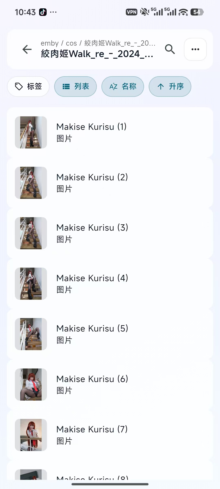
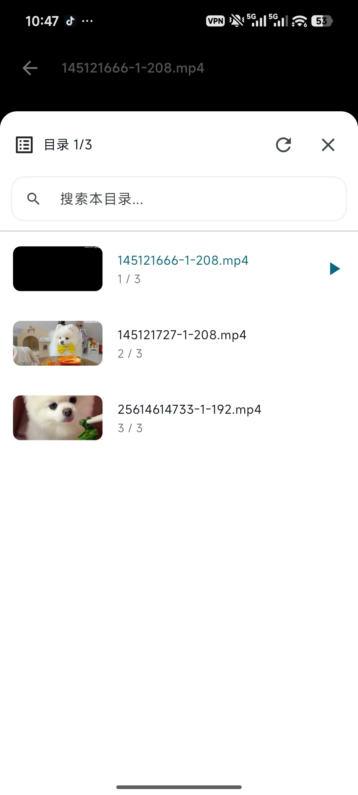

# Glacier

Glacier 是一个面向 Android 的媒体浏览与播放应用，支持本地目录、WebDAV、Emby 三类来源统一管理，覆盖收藏、检索、浏览、播放和回看等完整流程。

## 核心功能介绍

### 1. 收藏夹控制台
统一管理媒体入口，支持快速创建收藏夹、查看来源数量、进入常用资源。


### 2. 快捷菜单中心
在收藏夹页可直接进入历史记录、设置、标签管理、WebDAV、Emby 等关键模块，减少跳转成本。



### 3. 目录浏览与筛选
支持列表视图、搜索、标签过滤、名称排序与升降序切换，适合大规模图片/视频目录快速定位。


### 4. 视频播放目录浮层
播放中可打开目录浮层查看当前播放列表，并快速切换上下条目，提升连续观看体验。



### 5. 图片查看器
支持沉浸式浏览与当前位置显示，便于连续查看同目录图片内容。


## 技术栈

- Flutter
- media_kit / media_kit_video
- shared_preferences
- file_picker
- path_provider
- video_thumbnail

## 快速开始

### 1. 安装依赖

```bash
flutter pub get
```

### 2. 运行（Android）

```bash
flutter run -d android
```

### 3. 打包发布

```bash
flutter build apk --release
```

APK 输出路径：

`build/app/outputs/flutter-apk/app-release.apk`

## 项目结构

- `lib/main.dart`：应用入口
- `lib/pages.dart`：收藏夹与目录主流程
- `lib/video.dart`：视频播放器
- `lib/image.dart`：图片查看器
- `lib/webdav.dart`：WebDAV 模块
- `lib/emby.dart`：Emby 模块
- `lib/tag.dart`：标签模块
- `assets/feature/`：README 功能图资源
