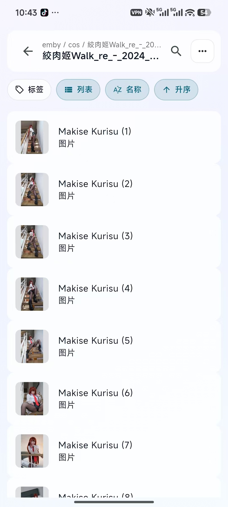
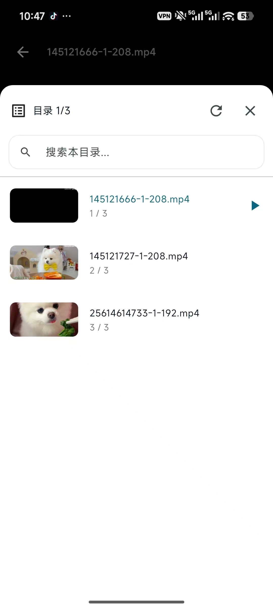

# Glacier

Glacier 是一个面向 Android 的媒体浏览与播放应用，统一管理三类来源：

- 本地目录
- WebDAV
- Emby

它覆盖了从收藏、浏览、搜索、筛选，到图片查看、视频播放、历史回看、标签管理的完整流程。

## 项目目标

Glacier 重点解决以下几类使用场景：

- 把分散在本地、WebDAV、Emby 的媒体入口统一收进一个收藏夹体系
- 在大量图片、视频目录中快速定位内容
- 用尽量低干扰的方式进行移动端和桌面端播放
- 为历史、标签、封面、字幕、播放进度提供稳定的日常体验

## 核心功能

### 1. 收藏夹控制台

统一管理媒体入口，支持快速创建收藏夹、查看来源数量、进入常用资源。


### 2. 快捷菜单中心

在收藏夹页可直接进入历史记录、设置、标签管理、WebDAV、Emby 等关键模块，减少跳转成本。



### 3. 目录浏览与筛选

支持列表视图、搜索、标签过滤、名称排序与升降序切换，适合大规模图片/视频目录快速定位。


### 4. 视频播放目录浮层

播放中可打开目录浮层查看当前播放列表，并快速切换上下条目，提升连续观看体验。



### 5. 图片查看器

支持沉浸式浏览与当前位置显示，便于连续查看同目录图片内容。


## 支持的媒体来源

### 本地目录

- 直接浏览本地文件夹
- 支持图片和视频识别
- 支持本地字幕候选自动发现

### WebDAV

- 保存 WebDAV 账号后可直接浏览远程目录
- 支持远程图片、视频、封面和基础缓存
- 支持从目录页直接进入播放/查看

### Emby

- 支持 Emby 账号登录与保存
- 支持读取媒体库、继续播放、封面和播放进度
- 支持 Emby 字幕轨道、播放会话和专属收藏夹 UI

## 主要页面说明

### 收藏夹页

- 作为应用主入口
- 展示收藏夹列表和快捷入口
- 可进入历史记录、设置、标签、账号管理

### 目录页

- 浏览收藏夹下的媒体内容
- 支持视图模式切换、排序、搜索、标签过滤
- 支持本地 / WebDAV / Emby 目录统一体验

### 视频播放器

- 移动端和桌面端使用不同交互实现
- 支持目录切换、倍速、历史进度、字幕、播放会话
- 支持移动端体感方向切换与方向锁定

### 图片查看器

- 支持沉浸式查看
- 支持条带模式和定位返回
- 支持本地 / WebDAV / Emby 图片源

### 标签系统

- 支持给目录、文件、远程条目标记 Tag
- 支持按标签回看和过滤
- 支持批量打标

### 历史记录

- 保存播放历史和目录进入历史
- 支持从历史继续播放
- 支持清空历史

## 设置项概览

当前设置页已覆盖以下常用项：

### 字幕

- 字幕大小
- 字幕位置（距底部）
- 字幕背景透明度
- 字幕描边开关

### 视频播放

- 长按倍速
- 长按倍速乘数
- 隐藏控制栏时显示细进度条
- 启用播放目录
- 显示上下集按钮
- 锁定时允许暂停/拖动
- 打开目录时定位到当前播放项
- 自动从上次进度继续播放
- 显示“继续播放”提示

### 图片

- 音量键翻页
- 退出图片后定位到最后浏览项

### 收藏夹 / 历史 / 标签

- 启动后自动进入上次收藏夹
- 按目录独立记忆视图和排序
- Emby 专用收藏夹 UI
- 历史记录开关
- 标签功能开关

## 技术栈

- Flutter
- `media_kit` / `media_kit_video`
- `video_player`
- `shared_preferences`
- `flutter_secure_storage`
- `file_picker`
- `path_provider`
- `video_thumbnail`
- `native_device_orientation`

## 运行要求

### 当前主要目标平台

- Android

### Flutter / Dart

- Flutter SDK 对应 `pubspec.yaml`
- Dart SDK: `>=3.3.0 <4.0.0`

## 快速开始

### 1. 安装依赖

```bash
flutter pub get
```

### 2. 运行（Android）

```bash
flutter run -d android
```

### 3. 代码检查

```bash
flutter analyze lib
```

### 4. 打包发布

```bash
flutter build apk --release
```

APK 输出路径：

`build/app/outputs/flutter-apk/app-release.apk`

## 常用开发说明

### Emby / WebDAV 账号保存

- 账号主体信息保存在 `shared_preferences`
- 密钥、密码等敏感字段通过 `flutter_secure_storage` 存储

### 播放器方向逻辑

- 移动端优先使用原生方向控制
- Flutter 侧保留传感器兜底逻辑
- 可通过播放器内方向锁定防止误旋转

### 字幕显示

- 本地字幕与 Emby 字幕轨道都已支持
- 字幕大小、底部偏移、背景透明度、描边可在设置中调整

## 项目结构

### 顶层入口

- `lib/main.dart`：应用入口
- `lib/pages.dart`：收藏夹与目录主入口
- `lib/video.dart`：视频播放器主入口
- `lib/image.dart`：图片查看器主入口
- `lib/webdav.dart`：WebDAV 主入口
- `lib/emby.dart`：Emby 主入口
- `lib/tag.dart`：标签模块主入口

### 主要子目录

- `lib/app/`：应用级配置
- `lib/core/`：基础能力、设置、缓存、安全存储
- `lib/pages/`：目录页相关实现
- `lib/player/`：视频播放器拆分实现
- `lib/image/`：图片查看器拆分实现
- `lib/tag/`：标签模块拆分实现
- `lib/emby/`：Emby 扩展 UI 与辅助实现
- `lib/sources/`：来源引用与账号工具
- `lib/ui/`：通用 UI 工具
- `lib/debug/`：调试工具页

更细的代码分层说明见：

- `lib/README.md`

## 当前代码组织说明

项目已经从早期“根目录大量平铺文件”整理为“入口文件 + 领域子目录”的结构。

例如：

- `video.dart` 现在作为播放器聚合入口
- `player/` 目录中继续拆分为：
  - 宿主
  - 状态类
  - 播放源解析
  - 字幕
  - 设置同步
  - 历史同步
  - 目录弹层
  - 移动端控制动作

这样更利于后续继续维护和重构。

## 资源目录

- `assets/icon/`：应用图标资源
- `assets/feature/`：README 功能截图资源

## 已知说明

- 当前 README 以 Android 使用与开发为主
- 若你继续扩展 iOS / 桌面能力，建议同步补平台差异说明
- 如果继续做大规模重构，建议保持 `flutter analyze lib` 持续全绿

## 建议的提交前检查

```bash
flutter analyze lib
```

如果涉及 Android 原生方向、存储或播放器行为，建议额外手测：

- 视频播放进入/退出
- 自动横竖屏与方向锁定
- Emby 配置重启后恢复
- 字幕设置即时生效

## 说明

这个 README 主要面向项目使用和开发入门。

如果你想继续完善文档，后续最适合增加的内容是：

- 使用演示 GIF / 视频
- Emby / WebDAV 配置流程图
- 常见问题 FAQ
- 开发贡献规范
